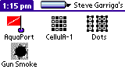
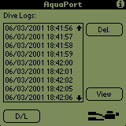
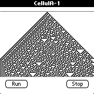

# PalmOS_stuff

Back in the mists of time (i.e., late '90s - early 2000's) cell phones were not ubiquitous and didn't do much more than let you make calls. Those of us that wanted truly mobile computing carried a separate device; a [PDA](https://en.wikipedia.org/wiki/Personal_digital_assistant). One of the most popular ecosystems of the time was PalmOS. 

For fun, I wrote a few applications for my [Palm IIIc](https://en.wikipedia.org/wiki/Palm_IIIc) and/or [Handspring Visor](https://en.wikipedia.org/wiki/Handspring_(company)) and I've just come across the archive CD-Rom.

At the time these were published as "freeware" on PalmSpot.com (since defunct); I'm now making them Public Domain, but have no way to confirm they even compile. If they're of use to you, enjoy!

Requires CodeWarrior toolchain (or the knowledge how to convert to something else). The AquaPort conduit used Visual C++ too, I believe.

## GunSmoke
I think this was my first attempt... When target pistol shooting, if hits cluster away from the point of aim, the relative location of hits **may** give a clue to what is going wrong.

## AquaPort
I used to SCUBA dive a lot and used a Citizen HyperAqualand dive watch that recorded my dive profile. Data from the watch could be downloaded to a PC over an RS232 based interface. Laptops used to be big, heavy, and expensive. The Palm IIIc was much smaller and relatively affordable. AquaPort allowed me to stage the download in my PDA (freeing memory on the watch) **and** view a profile graph.

## Cellula-1
A one dimensional cellular automaton.

## Dotz
A simple join the dots to form a square game. I'm not 100% sure if either commit-point is the fully debugged version.

## Boids/Boidz
I think this was a *work-in-progress* attempt at a Boids flocking simulation. I have no idea if it worked when I made the CD back-up.
